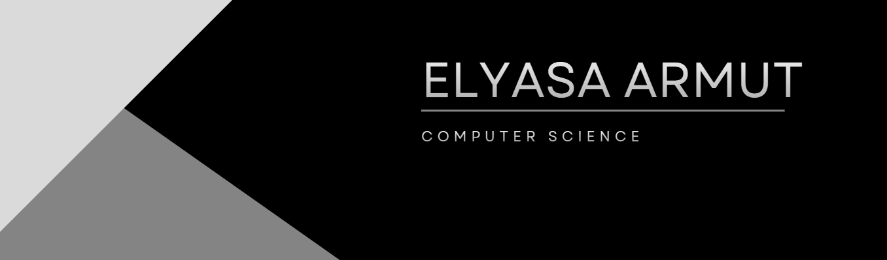

## About Me

3rd-year Computer Engineering student at ESOGÜ and Software Developer focused on full-stack web, mobile applications, and AI integrations. I enjoy taking projects from scratch through to deployment, encompassing modern UI/UX design (SaaS aesthetics), database architecture, and complex API integrations. I build real-world applications to strengthen my technical skills and currently lead the technical development for a startup project. 

* **Programming Languages:** C#, Python, SQL, JavaScript, Java, Swift, Dart.
* **Technologies & Frameworks:** Flutter, SwiftUI, LLMs, GraphRAG, Computer Vision, Edge AI, Cloud Architecture.
* **Focus Areas:** Writing clean, maintainable code and solving algorithmic optimization problems (like G-VRP). 

## Contact

  
  

